# Bot Avatar

[](https://github.com/stevenchen49/botavatar/actions/workflows/ci.yml)

Deterministic avatars for software bots. A **template** fixes the bot type, an **instance** adds hair and a personal badge, and a **state** shows what the bot is doing. The same request always produces the same SVG.

SVG is the primary format. PNG is available at 64, 128, 256, and 512 pixels. The shipped style is `flat-2d` (Soft Layered 2D): oversized hats, colored hair, a cream mouthless face, and capsule eyes.

## Gallery

These are 256-pixel PNG files exported by this repo's CLI from catalog manifest 1.9.5, with a transparent background. One picture for each hat silhouette. Coder uses `hair-crop`; the others use `hair-sweep`. All of them are `idle`.

<table>
  <tr>
    <td align="center">
      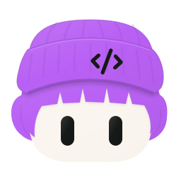<br>
      <sub><b>Coder</b><br>beanie · <code>assistant</code></sub>
    </td>
    <td align="center">
      <br>
      <sub><b>Research</b><br>beret · <code>research</code></sub>
    </td>
    <td align="center">
      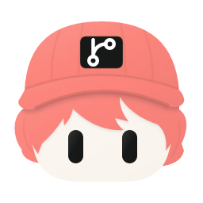<br>
      <sub><b>Git</b><br>cap · <code>git</code></sub>
    </td>
  </tr>
  <tr>
    <td align="center">
      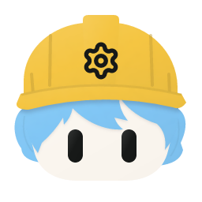<br>
      <sub><b>Build</b><br>hard hat · <code>build</code></sub>
    </td>
    <td align="center">
      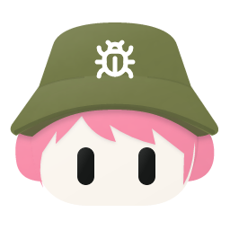<br>
      <sub><b>Debug</b><br>bucket · <code>debug</code></sub>
    </td>
    <td align="center">
      <br>
      <sub><b>Search</b><br>deerstalker · <code>search</code></sub>
    </td>
  </tr>
  <tr>
    <td align="center">
      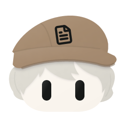<br>
      <sub><b>Docs editor</b><br>flat cap · <code>docs-editor</code></sub>
    </td>
    <td align="center">
      <br>
      <sub><b>Security officer</b><br>patrol cap · <code>security-officer</code></sub>
    </td>
    <td align="center">
      <br>
      <sub><b>Aviator</b><br>flight cap · <code>deploy-aviator</code></sub>
    </td>
  </tr>
</table>

### Same bot, six states

Coder (`assistant`, `hair-crop`) keeps the same hat and hair. Only `state` changes.

<table>
  <tr>
    <td align="center">
      <br>
      <sub><code>idle</code></sub>
    </td>
    <td align="center">
      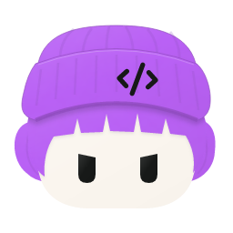<br>
      <sub><code>working</code></sub>
    </td>
    <td align="center">
      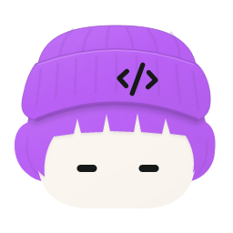<br>
      <sub><code>waiting</code></sub>
    </td>
  </tr>
  <tr>
    <td align="center">
      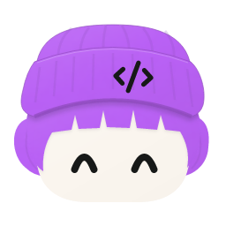<br>
      <sub><code>success</code></sub>
    </td>
    <td align="center">
      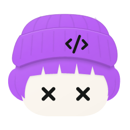<br>
      <sub><code>error</code></sub>
    </td>
    <td align="center">
      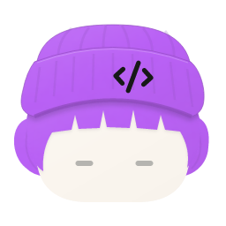<br>
      <sub><code>offline</code></sub>
    </td>
  </tr>
</table>

The files in [`docs/images/`](docs/images) are committed README previews. Review exports under `output/` stay untracked. Regression SVGs live in [`tests/snapshots/`](tests/snapshots).

## Quick start

Use Node.js 22.14 or later in the 22.x line, or Node.js 24.x, and pnpm 11.25.0. CI pins Node in [`.node-version`](.node-version).

```sh
pnpm install --frozen-lockfile
pnpm build
mkdir -p output
pnpm avatar --request examples/requests/assistant.json --output output/avatar.svg
```

<p>
  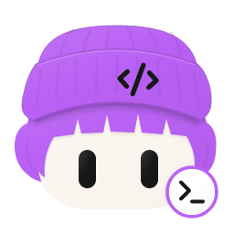
</p>

[`examples/requests/assistant.json`](examples/requests/assistant.json) is that Coder avatar: seed `stage-2`, crop hair, a purple terminal badge, and a transparent background. Omit `--output` to print SVG on stdout. The CLI leaves existing files untouched.

For PNG, set `"format": "png"` in the request. The filename does not select the format. Batch input is a JSON array of 1–100 requests, up to 1 MiB. The output directory must be new; when generation succeeds it contains numbered files and a `manifest.json`.

```sh
pnpm avatar --batch examples/requests/batch.json --output-dir output/my-batch
```

Studio and the local API:

```sh
pnpm build && pnpm start
```

Open <http://127.0.0.1:3000>. The server listens on loopback only. Set `PORT` to change it. `BOT_AVATAR_INSTANCES` can point at a read-only JSON map such as [`examples/instances/local.json`](examples/instances/local.json).

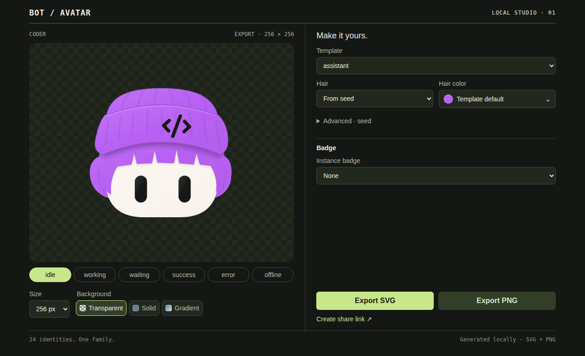

That is the default Studio screen: the avatar preview and state controls on the left, with template, hair, and badge settings on the right.

## Commands

| Command              | Purpose                                                                       |
| -------------------- | ----------------------------------------------------------------------------- |
| `pnpm check`         | Workspace policy, formatting, lint, TypeScript, tests, and a production build |
| `pnpm format`        | Apply Prettier                                                                |
| `pnpm avatar --help` | Print CLI usage                                                               |
| `pnpm start`         | Serve the API and Studio on `127.0.0.1:3000`                                  |
| `pnpm studio`        | Run the Vite dev server; start the API in another terminal                    |

Build once before `pnpm avatar` or `pnpm start`. In pipelines, run `node apps/cli/dist/main.js` so package-manager logs stay off stdout. Unknown flags and invalid input exit 2. I/O and conversion errors exit 1.

## Catalog

Manifest **1.9.5** in `packages/design-tokens` is the current `flat-2d` catalog: three public hairstyles (`hair-sweep`, `hair-crop`, `hair-wave`) and the six states above.

Twenty original templates, with the role alias in parentheses when it differs from the id:

`assistant` (coder), `research`, `docs`, `git`, `review`, `shell`, `build`, `debug`, `printer`, `network`, `ai`, `general`, `builder` (test), `deploy`, `monitor`, `caretaker` (security), `design`, `data`, `search`, `support`.

Four optional templates reuse a role with another hat or palette: `docs-editor`, `security-officer`, `deploy-aviator`, and `build-red`.

A role name resolves to one default template. Instance badge aliases are `dot`, `check`, `terminal`, `search`, and `server`. Colors are catalog token ids. Unknown fields and unsupported choices fail validation. Request details are in the [CLI guide](apps/cli/README.md).

## Architecture

```text
request
  -> validate
  -> normalize against the versioned catalog
  -> compose layers
  -> flat-2d SVG
  -> optional PNG
```

| Piece                                              | Responsibility                                                                                           |
| -------------------------------------------------- | -------------------------------------------------------------------------------------------------------- |
| [`packages/core`](packages/core)                   | Contracts, validation, seeded defaults, and composition. No filesystem, network, process, DOM, or clock. |
| [`packages/design-tokens`](packages/design-tokens) | Colors, templates, roles, and the catalog manifest.                                                      |
| [`packages/renderer-svg`](packages/renderer-svg)   | `flat-2d` SVG from embedded assets.                                                                      |
| [`packages/renderer-png`](packages/renderer-png)   | SVG-to-PNG conversion.                                                                                   |
| [`apps/cli`](apps/cli), [`apps/api`](apps/api)     | Files and HTTP.                                                                                          |
| [`apps/studio`](apps/studio)                       | Browser controls. Preview and export go through the API.                                                 |

State changes keep template and instance identity. CLI and API return the same SVG for the same effective input. The [architecture guide](docs/architecture.md) is the source of truth for boundaries and for what a second visual style would still require.

## Documentation

- [Architecture](docs/architecture.md) and [architecture decisions](docs/decisions/0001-workspace-foundation.md)
- [Visual style](docs/visual-style.md)
- [Review stages](docs/roadmap.md)
- [Local and offline use](docs/local-distribution.md)
- [Directory structure](docs/directory-structure.md) and [coding standards](docs/coding-standards.md)
- [CLI](apps/cli/README.md), [API](apps/api/README.md), and [Studio](apps/studio/README.md)
- [Request example](examples/requests/assistant.json), [batch example](examples/requests/batch.json), and [instance map](examples/instances/local.json)
- [Contributing](CONTRIBUTING.md) and [agent instructions](AGENTS.md)
- [Asset notices](assets/LICENSES.md)

Maintained repository text is English. Ignored local drafts under `docs/draft/` are not required to build or understand the project.

## License

Released under the [MIT License](LICENSE). Third-party icon notices are in [assets/LICENSES.md](assets/LICENSES.md).
