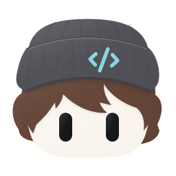
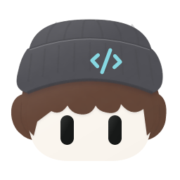
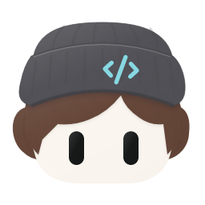
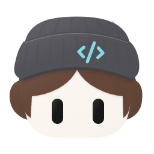
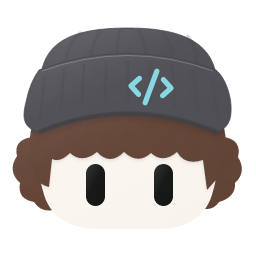
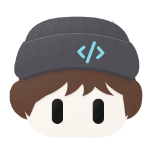
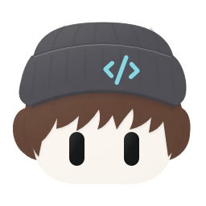

<p align="center">
  
</p>

# Bot Avatar

[](https://github.com/stevenchen49/botavatar/actions/workflows/ci.yml)

Deterministic avatars for software bots. A **template** fixes the bot type, an **instance** adds hair and a personal badge, and a **state** shows what the bot is doing. The same request always produces the same SVG.

SVG is the primary format. PNG is available at 64, 128, 256, and 512 pixels. The shipped style is `soft-layered-2d` (Soft Layered 2D): oversized hats, colored hair, a cream mouthless face, and capsule eyes.

## Gallery

<!-- readme:gallery:start -->

256-pixel PNG examples from catalog **1.15.0**, rendered with a transparent background. Each role below uses an explicit hairstyle from the current catalog.

<table>
  <tr>
    <td align="center">
      <br>
      <sub><b>Coder</b><br>beanie · <code>coder</code></sub>
    </td>
    <td align="center">
      <br>
      <sub><b>Research</b><br>beret · <code>research</code></sub>
    </td>
    <td align="center">
      <br>
      <sub><b>Git</b><br>cap · <code>git</code></sub>
    </td>
  </tr>
  <tr>
    <td align="center">
      <br>
      <sub><b>Build</b><br>hard hat · <code>build</code></sub>
    </td>
    <td align="center">
      <br>
      <sub><b>Debug</b><br>bucket · <code>debug</code></sub>
    </td>
    <td align="center">
      <br>
      <sub><b>Search</b><br>deerstalker · <code>search</code></sub>
    </td>
  </tr>
  <tr>
    <td align="center">
      <br>
      <sub><b>Docs editor</b><br>flat cap · <code>docs-editor</code></sub>
    </td>
    <td align="center">
      <br>
      <sub><b>Security officer</b><br>patrol cap · <code>security-officer</code></sub>
    </td>
    <td align="center">
      <br>
      <sub><b>Aviator</b><br>flight cap · <code>deploy-aviator</code></sub>
    </td>
  </tr>
</table>

### Hairstyles

All 7 hairstyles on the same Coder, with the same hat, hair color, and idle state.

<table>
  <tr>
    <td align="center">
      <br>
      <sub><b>sweep</b><br><code>hair-sweep</code></sub>
    </td>
    <td align="center">
      <br>
      <sub><b>wave</b><br><code>hair-wave</code></sub>
    </td>
    <td align="center">
      <br>
      <sub><b>side part</b><br><code>hair-side-part</code></sub>
    </td>
  </tr>
  <tr>
    <td align="center">
      <br>
      <sub><b>curtain</b><br><code>hair-curtain</code></sub>
    </td>
    <td align="center">
      <br>
      <sub><b>soft curls</b><br><code>hair-soft-curls</code></sub>
    </td>
    <td align="center">
      <br>
      <sub><b>layered fringe</b><br><code>hair-layered-fringe</code></sub>
    </td>
  </tr>
  <tr>
    <td align="center">
      <br>
      <sub><b>wispy fringe</b><br><code>hair-wispy-fringe</code></sub>
    </td>
  </tr>
</table>

### Same bot, six states

Coder keeps the same hat and `hair-side-part` hair. Only `state` changes.

<table>
  <tr>
    <td align="center">
      <br>
      <sub><b>idle</b><br><code>idle</code></sub>
    </td>
    <td align="center">
      <br>
      <sub><b>working</b><br><code>working</code></sub>
    </td>
    <td align="center">
      <br>
      <sub><b>waiting</b><br><code>waiting</code></sub>
    </td>
  </tr>
  <tr>
    <td align="center">
      <br>
      <sub><b>success</b><br><code>success</code></sub>
    </td>
    <td align="center">
      <br>
      <sub><b>error</b><br><code>error</code></sub>
    </td>
    <td align="center">
      <br>
      <sub><b>offline</b><br><code>offline</code></sub>
    </td>
  </tr>
</table>

<!-- readme:gallery:end -->

The mark above the title is the half-size README logo (`assets/branding/bot-avatar-logo-readme.png`, 836×470). The full branding mark stays at `assets/branding/bot-avatar-logo.png` (1672×941). Avatar previews in [`docs/images/`](docs/images) are committed README images. Review exports under `output/` stay untracked. Regression SVGs live in [`tests/snapshots/`](tests/snapshots).

## Quick start

Use Node.js 22.14 or later in the 22.x line, or Node.js 24.x, and pnpm 11.25.0. CI pins Node in [`.node-version`](.node-version).

```sh
pnpm install --frozen-lockfile
pnpm build
mkdir -p output
pnpm avatar --request examples/requests/coder.json --output output/avatar.svg
```

<p>
  
</p>

<!-- readme:quick-start:start -->

The image above is generated directly from [`examples/requests/coder.json`](examples/requests/coder.json): template `coder`, hair `hair-side-part`, and a `terminal` instance badge. Omit `--output` to print SVG on stdout. The CLI leaves existing files untouched.

<!-- readme:quick-start:end -->

For PNG, set `"format": "png"` in the request. The filename does not select the format. Batch input is a JSON array of 1–100 requests, up to 1 MiB. The output directory must be new; when generation succeeds it contains numbered files and a `manifest.json`.

```sh
pnpm avatar --batch examples/requests/batch.json --output-dir output/my-batch
```

Studio and the local API:

```sh
pnpm build && pnpm start
```

Open <http://127.0.0.1:3000>. The server listens on loopback only. Set `PORT` to change it. `BOT_AVATAR_INSTANCES` can point at a read-only JSON map such as [`examples/instances/local.json`](examples/instances/local.json).


That is the default Studio screen: the avatar preview and state controls on the left, with template, hair, and badge settings on the right.

## Commands

| Command              | Purpose                                                                       |
| -------------------- | ----------------------------------------------------------------------------- |
| `pnpm docs:readme`   | Refresh README examples, catalog summary, and Studio screenshot               |
| `pnpm check`         | Workspace policy, formatting, lint, TypeScript, tests, and a production build |
| `pnpm format`        | Apply Prettier                                                                |
| `pnpm avatar --help` | Print CLI usage                                                               |
| `pnpm start`         | Serve the API and Studio on `127.0.0.1:3000`                                  |
| `pnpm studio`        | Run the Vite dev server; start the API in another terminal                    |

Build once before `pnpm avatar` or `pnpm start`. In pipelines, run `node apps/cli/dist/main.js` so package-manager logs stay off stdout. Unknown flags and invalid input exit 2. I/O and conversion errors exit 1.

### Refresh the examples

Run `pnpm docs:readme` after catalog or rendering changes. It builds the project,
regenerates the role gallery from [`examples/readme.json`](examples/readme.json),
shows every catalog hairstyle, updates all six states and the quick-start image,
and captures the current Studio. README version text comes from the catalog.
The browser step requires Playwright Chromium (`pnpm exec playwright install chromium`).
To use installed Google Chrome instead, run `PLAYWRIGHT_CHANNEL=chrome pnpm docs:readme`.

To change the featured roles or hair choices, edit `examples/readme.json`; the
quick-start image reads `examples/requests/coder.json` directly. Only marked README
sections and generated example images are rewritten. Review the resulting diff
before committing. This command does not update approved visual test baselines.

## Catalog

The canonical style ID is `soft-layered-2d`. Explicit `flat-2d` requests remain
supported as a legacy alias and normalize to the canonical ID.

<!-- readme:catalog:start -->

Manifest **1.15.0** in `packages/design-tokens` is the current `soft-layered-2d` catalog: 24 templates, 7 hairstyles (`hair-sweep`, `hair-wave`, `hair-side-part`, `hair-curtain`, `hair-soft-curls`, `hair-layered-fringe`, `hair-wispy-fringe`), and 6 states.

<!-- readme:catalog:end -->

Twenty original templates. The public id is the role name:

`coder`, `research`, `docs`, `git`, `review`, `shell`, `build`, `debug`, `printer`, `network`, `ai`, `general`, `test`, `deploy`, `monitor`, `security`, `design`, `data`, `search`, `support`.

Legacy request ids still resolve: `assistant` selects `coder`, `builder` selects `test`, and `caretaker` selects `security`. Optional templates keep a role-modifier id: `docs-editor`, `security-officer`, `deploy-aviator`, and `build-red`.

`research` and `ai` both wear `badge-sparkle`. The catalog has no separate academic emblem, so research keeps that badge.

A role name resolves to one default template. Instance badge aliases are `dot`, `check`, `terminal`, `search`, and `server`. Colors are catalog token ids. Unknown fields and unsupported choices fail validation. Request details are in the [CLI guide](apps/cli/README.md).

## Architecture

```text
request
  -> validate
  -> normalize against the versioned catalog
  -> compose layers
  -> soft-layered-2d SVG
  -> optional PNG
```

| Piece                                              | Responsibility                                                                                           |
| -------------------------------------------------- | -------------------------------------------------------------------------------------------------------- |
| [`packages/core`](packages/core)                   | Contracts, validation, seeded defaults, and composition. No filesystem, network, process, DOM, or clock. |
| [`packages/design-tokens`](packages/design-tokens) | Colors, templates, roles, and the catalog manifest.                                                      |
| [`packages/renderer-svg`](packages/renderer-svg)   | `soft-layered-2d` SVG from embedded assets.                                                              |
| [`packages/renderer-png`](packages/renderer-png)   | SVG-to-PNG conversion.                                                                                   |
| [`apps/cli`](apps/cli), [`apps/api`](apps/api)     | Files and HTTP.                                                                                          |
| [`apps/studio`](apps/studio)                       | Browser controls. Preview and export go through the API.                                                 |

State changes keep template and instance identity. CLI and API return the same SVG for the same effective input. The [architecture guide](docs/architecture.md) is the source of truth for boundaries and for what a second visual style would still require.

## Documentation

- [Architecture](docs/architecture.md) and [architecture decisions](docs/decisions/0001-workspace-foundation.md)
- [Visual style](docs/visual-style.md)
- [Review stages](docs/roadmap.md)
- [Local and offline use](docs/local-distribution.md)
- [Directory structure](docs/directory-structure.md) and [coding standards](docs/coding-standards.md)
- [CLI](apps/cli/README.md), [API](apps/api/README.md), and [Studio](apps/studio/README.md)
- [Request example](examples/requests/coder.json), [batch example](examples/requests/batch.json), and [instance map](examples/instances/local.json)
- [Contributing](CONTRIBUTING.md) and [agent instructions](AGENTS.md)
- [Asset notices](assets/LICENSES.md)

Maintained repository text is English. Ignored local drafts under `docs/draft/` are not required to build or understand the project.

## License

Released under the [MIT License](LICENSE). Third-party icon notices are in [assets/LICENSES.md](assets/LICENSES.md).
